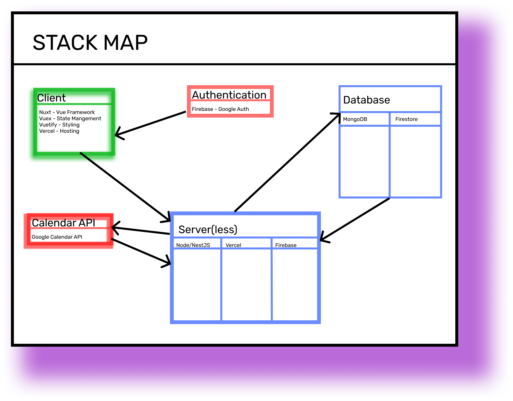
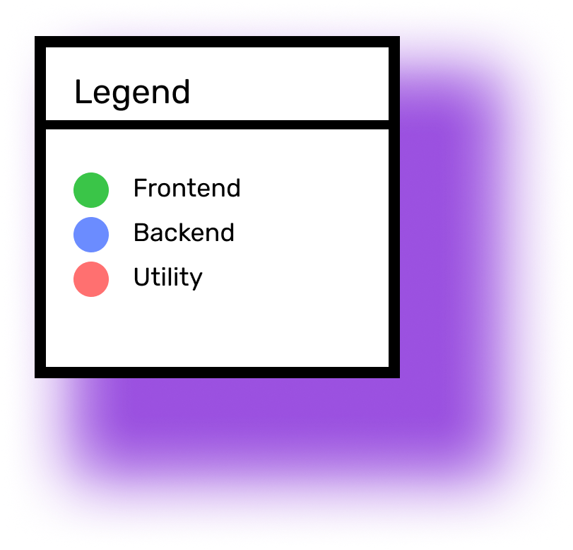

<!-- @format -->

hi there

# DevOps Stack Strategy

- [DevOps Stack Strategy](#devops-stack-strategy)
  - [Front-end (Client)](#front-end-client)
    - [Nuxt - Vue](#nuxt---vue)
    - [Veux - State Management](#veux---state-management)
    - [Veutify - Styling](#veutify---styling)
  - [Backend (Servers/Serverless)](#backend-serversserverless)
    - [Web host](#web-host)
    - [Database](#database)
  - [APIs (user data)](#apis-user-data)
    - [Authentication](#authentication)
    - [Calendar](#calendar)

This is to work out possible DevOps hosting strategies.

## Front-end (Client)

This is for the front-end ("views") including the HTML, JavaScript, and any client related build process.

> **Note**: For Client authorization or identify and calendar see [APIs](#APIs)

### Nuxt - Vue

- We are using:
  - Vue because it's an approachable JavaScript framework
  - Nuxt.js because it stable PWA solution (built on VUE.js)

### Veux - State Management

### Veutify - Styling

## Backend (Servers/Serverless)

"Backend" is used loosely i.e., these components could be serveless functions.

### Web host

- AWS
  - Pro:
  - Con:
- Vultr
  - Pro: Already have a server paid for
  - Con: Don't know how it scales, we have to do everything
- Vercel
  - Pro: It's, like, magic
  - Con: Too expensive for our set up

### Database

- MongoDB
  - Pro:
  - Con:
- firebase serverless
  - Pro:
  - Con:
- vercel serverless
  - Pro:
  - Con:

## APIs (user data)

### Authentication

- Firebase - Google Auth

### Calendar

- Google Calender API
